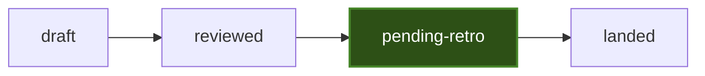

# Flow: Common — lifecycle + implementation machinery

> **Process is recommendation, not ceremony.** `flow-*` is a toolbox, not rigid enforcement. Weigh each step against the frozen requirements and current architecture. Skip any step that does not change the outcome. Completing a skill checklist is not success. Do not write designs, grills, or receipts whose only job is to bless work already specified.

**One job:** Host the machinery every flow shares — the design status lifecycle, role-to-impl mapping, the implementation gate, wrong-machine supersession, and **breakout adjudication**. `flow-grill-review` (review gate) and `flow-retro` (loop closing) reference this skill; the goal-file workstream plan and the `flow:impl NN` / `flow:retro NN` phrases dispatch through it. Do not restate this skill's internals in the other flows. The goal file (`goal-file`) is the administrative source (frozen root + funnel). This skill runs those slots.

## Lifecycle

The design file's `## Status` line is one word, set by exactly one owner:

| Word | Meaning | Set by |
| --- | --- | --- |
| `draft` | written, not yet grilled | drafter; **or** breakout adjudication (status revert) |
| `reviewed` | passed grill; every accepted P1 solved; P2/P3 swept; design body is current speech | `flow-grill-review` (review gate) |
| `pending-retro` | implementation complete; fresh evidence proves the user outcome; no blocking mismatch; the closing retro has not run | the implementation gate (this skill) |
| `landed` | the whole loop finished: design + implementation + retro closed | `flow-retro` (closing pass) |

- A `reviewed` / `pending-retro` / `landed` design that is the **wrong machine** is superseded by a new `design/NN` — never un-reviewed, un-pended, or un-landed on that path.
- A superseded file keeps its last status and gains the `Superseded by:` line; a file superseded before its loop completed never lands.
- Sweep files (`Status: draft-followup`) are not lifecycle states.
- **`flow-retro` is the only route back out of `pending-retro` for impl defects and light closes.** An implementer never silently restarts implementation, and never invents a second status setter.
- **Wrong-machine outer loop:** stop. Obsolete the failed design (`Superseded by:`). Discard the source it introduced. Open a new `design/NN` from the goal file (frozen root + live additions). Lessons in the worklog. Do not revert status on the failed file.
- **Breakout adjudication** (architecture redesign): the other exit of a failed inner impl loop — when/how below. This path **may revert** impacted designs to `draft`. Inner-loop AC checks still align to **Covers** → frozen root.

## Roles

**Manager is the primary role.** The manager's main responsibility and success
criterion is to deliver the frozen root requirements as a complete, coherent,
current-model product with sensible architecture and proportionate time cost.
Designs, code, tests, reviews, compiler output, and runtime observations are
evidence toward that outcome; completing process steps or delegated tasks is
not success by itself. The manager may delegate execution, evidence, and
independent review, but delegation transfers work only; it never transfers
responsibility for the architecture, decisions, scope, acceptance, or final
product outcome. The manager must use the evidence to continue, correct,
reject, or redirect work until that success criterion is actually met.

The manager performs these duties in one seat:

- **Supervisor / orchestrator:** sequence work, define bounded workstreams,
  dispatch and resume agents, maintain receipts, and gate promotions.
- **Architect / defender:** author and defend the design, reject machinery that
  is not required by the root, arbitrate findings, and redesign when evidence
  proves the current machine wrong.
- **Outcome verifier:** inspect the whole product and evidence against the root
  before accepting completion.

A **role** is a duty in the loop. An **impl** is who occupies it for this run.
The manager may hold the duties above together; an independent reviewer may not
also be the manager for the same artifact.

| Impl | What it is |
|---|---|
| **This session** | The agent running the skill |
| **Subagent** | Spawned child, separate context |
| **Forked agent** | Isolated checkout / worktree agent |
| **Peer agent** | Another pane, product, or seated agent |
| **Owner** | Human. Gates only unless they take a worker role |

Reviewer **independent** means subagent / forked agent / peer agent. The manager
cannot independently review the same artifact it directs. Owner is not a
required reviewer.

| Role | Need | Suits | Not |
|---|---|---|---|
| **Manager** | yes — primarily accountable for the complete root-defined product and its sensible time/architecture cost; combines supervisor/orchestrator, architect/defender, and outcome-verifier duties; gates every direction and promotion | this session | delegated reviewer or implementer |
| **Supervisor / orchestrator duty** | yes — sequences angles, dispatch, worklog, Status; resumes the implementer after Prep; gates after review before `flow:impl` | manager | reviewer impls (they must not adjudicate or set Status) |
| **Architect / defender duty** | yes — authors and defends the design, rejects unjustified machinery, adjudicates, rewrites accepted P1s | manager (default); peer agent only when explicitly designer of record | a reviewer on the same run |
| **Outcome verifier duty** | yes — checks the complete product and evidence against the frozen root before completion | manager | a reviewer whose evidence is the sole basis for self-acceptance |
| **Reviewer** | yes — bounded `PASS` / `NEEDS-FIX` / `NOT-REVIEWABLE` review result; no adjudication, edit, promotion, or impl **in the review turn** (a later impl seat is open to them) | subagent (default), forked agent, peer agent | manager on the same artifact |
| **Implementer** | only when the implementation gate runs | any agent | — |
| **Owner** | gate, not worker — commits, scope expansion, round-5 halt | owner | stalling grill waiting for them to review |

**Drafter / retro closer** are not live roles here. Draft is a precondition. `landed` is `flow-retro`.

A rematch's **review leg** uses the same reviewer candidate pool; reusing the reviewer who filed the P1s is allowed. Its defense and correction stay with the manager. Complex impl is usually delegated to a dedicated implementer, and the design's reviewer is eligible for that seat. Dispatch one stage at a time; roadmap context does not authorize later work.

Defaults: manager = this session, holding supervisor/orchestrator, architect/
defender, and outcome-verifier duties; reviewer = single independent subagent /
seat (batching all attack angles into one brief to minimize warm-up cost);
implementer = any agent the manager assigns.

**Manager re-warm:** before architecture, review-gate defense, breakout
adjudication, arbitration, promotion, or completion decisions, the manager
re-reads the goal file's **frozen root**, live additions, funnel edges, and this
design's **Covers** path. Residual session memory is not a substitute. If no
goal file exists, re-read the design heads.

Review-gate finding defense stays in `flow-grill-review` §3. Breakout adjudication is this skill.

## Breakout adjudication (architecture redesign)

Architecture is design-time only (`goal-file` scope analysis). It is **not** a workstream. It activates only on an inner-loop **breakout**.

### When

Run this process — and only this process — when **all** of:

1. An inner impl loop has **halted** (round-5 structural ceiling, or impl/retro classified **design mismatch / architecture failure**).
2. The failure is **not** an implementation-only defect (that remediates in place; status stays).
3. The failure is **not** yet proved a wrong machine (that is the supersession outer loop).

Do **not** run it: to start a sprint, to “improve” architecture without a halt, as a scheduled workstream, or because a reviewer filed ordinary grill findings (those are `flow-grill-review` §3).

### How

The manager adjudicates; the manager re-warms first; reviewer does not
adjudicate; implementer does not set Status.

1. **Halt.** Name the failing design and the structural cause in its worklog. Do not start another impl round.
2. **Start at the failing design.** Smallest architecture correction that would unstick the halt, as current speech (design-time).
3. **Propagate up.** Walk `goal-file` (6) **against** landing order (ui-ux → module → core-schema). At each upstream design: does the correction still compose? If yes and no body change, record `holds` and continue. If a fold is required, name the file **impacted**. Stop walking when the next step would be the frozen root.
4. **Validate against the frozen root.** The proposed fold must still satisfy the frozen user-requirements description. **The root does not change.** If the fold would need a root edit: stop this path. That is a new goal (or a dated owner restatement), not architecture redesign.
5. **Wrong-machine check.** If even after the upward walk the failing design cannot deliver its **Covers** rows, switch to the wrong-machine outer loop. Do not revert that file.
6. **Status revert (impacted only).** Each impacted design (including the failing one if it still holds as the machine): fold the architecture into the body as current speech; set `Status: draft`; update the goal-file Design files / Workflows lines. Record the revert (from-status, why, files) in each worklog. Implementer never does this.
7. **Re-enter.** Impacted designs re-enter `flow-grill-review` then impl, in (6) landing order. Unimpacted `landed` files stay landed.

## Implementation gate (reviewed → pending-retro)

The inner loop on one design is gated by the AC check along that design's **Covers** path to the goal root (`goal-file` workflow slot). A pass that does not move those rows is not a pass.

### Before dispatch

The implementer reads, in order: the goal file's frozen root + live additions, this design's **Covers** path, administrative requirements on the goal file, Prep skills, then the design body. They do not start the work until the manager resumes them onto this design.

### After the slice

Before claiming the round, the implementer self-reviews against the covered AC rows and the path to root. That self-review is the first-party evidence the supervisor grades. Skipping it is not a pass.

### Round budget (hard)

A **round** is one implementer dispatch → report → first-party grade cycle on the same reviewed design. Count them aloud in every bounce message ("round N") and record the final count in the worklog (`worklog/NN-<same-topic>.md`) — the design body stays canon and carries no ledger.

- **Rounds 1–2:** normal turbulence; remediate.
- **Rounds 3–4:** audit COMMUNICATION before touching code again — vague brief, non-deterministic fixture, dropped enumeration, mis-specified gate, or wrong acceptance evidence are the prime suspects. Rewrite the brief much more than the code.
- **Round 5 budget ceiling.** A round >5 is by definition a broken loop — not bad luck: the design is wrong, the brief is wrong, or the role is wrong. HALT, name the structural cause, and run **breakout adjudication**. Never start round 6 as if it were just another bounce.

### Verify the user outcome

Run verification proportional to risk, starting with the reviewed criteria and representative real data, then relevant regression coverage. A check counts only if it proves part of the user outcome or a necessary boundary; passing incidental tests is not closure.

- **Pass:** covered AC rows (path to root) prove the outcome and no blocking mismatch remains → set `Status: pending-retro` and hand to `flow-retro`.
- **Implementation defect:** remediate within the reviewed design, then rerun affected verification.
- **Design mismatch / architecture failure:** stop. **Breakout adjudication** (above).
- **Wrong machine** (proved at or after the upward walk): wrong-machine outer loop — do not silently restart impl, do not revert that file.

A concise `Design holds` note is optional evidence, never a required stage or no-op artifact. Refined reimplementation is not automatic.

### Commits

Commits follow explicit user authorization and meaningful artifact boundaries—not a fixed count or message template. A reviewed design and its implementation may be separate commits when useful; retro changes merit a commit only when they materially change an artifact. Never create no-op commits.

### Stop condition

The implementation stage ends when the reviewed current-scope outcome is demonstrated by fresh evidence, accepted blockers are resolved, and no authorized work remains — with the loop still open at `Status: pending-retro`. Do not continue into optional hardening, future compatibility, or reimplementation.

## User reporting convention

When reporting progress, lifecycle status, review outcomes, or transitions to the user:

- **Concise first:** summarize outcomes, decisions, and blockers directly; avoid repeating background narration or file dumps.
- **Mermaid diagram:** use compact Mermaid diagrams (e.g. `flowchart LR` or `stateDiagram-v2`) to visualize current phase, active states, dependencies, and completed vs pending transitions.
- **Accompanying legend:** every diagram must include an explicit legend explaining node shapes, colors/styles, status codes, and abbreviations so the user never has to poke around or guess meanings.

Example template:

```markdown
### Summary
- **Current status:** `reviewed` → implementing Workstream 1 (Phase P1)
- **Blockers:** None



**Legend:**
- `draft` — written, not yet reviewed
- `reviewed` — passed grill review
- `pending-retro` (highlighted) — implementation in progress / under verification
- `landed` — loop closed via retrospective
```

## Dispatch notes

- `flow:impl NN` — the caller dispatches the implementation seat to this skill's Implementation gate **after** the supervisor gate (review passed + re-warm). The goal-file workstream plan names the seat's work (Prep, gates, Covers path). Where no goal file exists, the same request that invoked grill names the implementation section. The phrase never implies a separate skill file.
- `flow:retro NN` — dispatch to `flow-retro` (closing pass).

## Done checklist (implementation gate)

- [ ] **P0 project-contract cleared:** nothing the project law bans — second-world assumptions, dual-world support (temporary included), epoch vocabulary, history-predicated shape selection, structurally compat arms reachable only from past-era data; covers code/comments/fixtures/tests/docs
- [ ] Round budget respected (count stated per bounce; >5 halted as structural, not retried)
- [ ] Smallest real-data-first vertical slice implemented without scope expansion
- [ ] Implementer Prep-read + manager resume happened before work; post-slice self-review against covered AC / path-to-root exists
- [ ] Fresh criteria prove the covered AC rows (path to root) and required boundaries
- [ ] `Status: pending-retro` set; loop handed to `flow-retro`
- [ ] Commits, if any, were authorized and match meaningful artifacts
