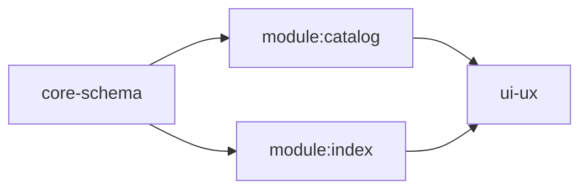

# <goal> — OPEN|BLOCKED|CLOSED-GREEN (<date>)

> **Standing law (compiled from the project's working principles, vendor not
> duplicate).** *Process is recommendation, not ceremony.* Steps may be skipped,
> simplified, merged, fast-pathed, or extended when the change serves the target.
> **Requirements & efficiency toward the goal always win over process.** A skip
> records a one-line reason in the worklog; completing a skill checklist is not
> success. Do not write designs, grills, or receipts whose only job is to bless
> work already specified. Rulings live in design files, dated; the goal file
> references them by path — a ruling never lives only here (it dies when the
> goal closes).

## Goal

The owner's words, verbatim. **NO EDIT once written.** If the target moves, that
is a new goal file, or a dated owner re-state appended below the original.

## User requirements — frozen root

The vendored description from the freeze table. **NO EDIT once frozen.** One-line
provenance at freeze (`frozen from: direct | design/NN User inputs |
design/NN Problem statement`). Numbered `R1`… rows partition the freeze for
covering and checkboxes; they do not rewrite it. Checkbox law: the goal is DONE
exactly when every live root box is checked with an evidence line.

- [ ] **R1** — …
- [ ] **R2** — …

- *Analysis* — working read of the frozen root. **Append-and-amend.**
- *Working background* — fact map (paths, seams, designs in force, live-world
  facts). **Kept current.**

## Additions to the root

Later numbered rows (`A11`… or any unused handle after the root). Each addition is
a binding extension or `obsoleted` (date + why + worklog pointer). Live additions
participate in the path-to-root; obsoleted ones do not.

## Design files

The new well-scoped set, each linked back here as admin source. One line: path —
**covers** `R#`/`A#` — **admin source:** this goal file. No design-body prose.
(§Design files is a pure index; the canonical status word lives on the per-design
line inside its Workstream, never here.)

- `design/01-<topic>.md` — covers R1 — admin source: this goal file

## Dependencies

**Scope analysis** (one impl scope per design; a design spanning two scopes is
not well-scoped — split it first. Architecture is design-time, not a scope; no
landing edge):

- design/NN — core-schema (cross-module data structure)
- design/PP — module:<name>
- design/QQ — ui-ux
- design/MM — design-time (architecture); not a scope

**Edges** (landing order; implied by scope unless a tighter edge exists):

- design/PP after design/NN
- design/QQ after design/PP

## Workstreams

A workstream is the **dispatch unit**: a scope-coherent group of designs that
share **one phase**. Merge by scope, never across a **generative edge** (see
below). The phase DAG's nodes are the workstreams; its edges give sequential
order (structural) and parallelizability (no edge). Architecture is design-time,
not a workstream.

### Phase P1 — <phase-name> — `brief` | `populated` | `closed`

Phase states. `brief` = one-line purpose + design list only (no bodies, no grill,
no impl). `populated` = brief expanded to full design bodies. `closed` = all
designs landed. Owner: the manager (supervisor/orchestrator duty). Trigger
`brief`→`populated`: all upstream generative deps at their threshold (`landed`
for outcome-volatile, `reviewed` for content-volatile). Reversion
`populated`→`brief` on replan after a breach/supersession.

- design/NN — `draft|reviewed|pending-retro|landed` — covers R1 — scope
  module:goal-file-skill

**Phase DAG** (inter-workstream only; intra-workstream edges live in that
workstream's workflow):

**Edges carry scope/dependency; a trailing workstream notes "feeds phase Y".**
Resource analysis on the phase DAG: `env-setup` / `env-teardown` /
`leave-it-there` / `env-share`. Parallelizability = **no structural edge AND no
resource edge** (cap 2–3 concurrent for supervisor depth).

**Per-workstream workflow flowchart** (process flow; the 4-word status table
stays the source of truth for status). Nodes: Prep (action) → Grill (decision) →
Defend (decision) → Rematch? (action) → Implement (decision) → Verify (action) →
Retro (action). Edge labels: `PASS` / `NEEDS-FIX` / `FAIL` / `ESCALATE` /
`ROUTE: BREAKOUT` / `ROUTE: SUPERSEDE` / `ROUTE: DEFER` / `SKIP`. FAIL never sets
a status; BREAKOUT may revert `draft`; SUPERSEDE keeps last status + `Superseded
by:`. Hooks are typed slots on an edge (`[+step]` / `[-step]`). **Legend
mandatory.** The edge-label vocabulary and this flowchart are defined in
`goal-authoring.md`; the `flow-*` skills reference them and reconcile toward this skill,
not the reverse. The four-word status table and roles live in `flow-common`.

## Workflow slots

One slot per design in Design files. Inner loop and wrong-design exit are
`flow-*`; this section only fills the slots.

### design/NN-<topic> — <status>
- **Admin source:** `goals/<this-file>.md`
- **Covers:** R# (path: A# → R# when an addition is live)
- **Scope:** core-schema | module:<name> | ui-ux | <named> | design-time
- **Depends on:** design/MM | none
- **Loop:** `flow-grill-review` → `flow:impl` (`flow-common`) → `flow-retro`
- **Gate:** AC check along **Covers** to the frozen root
- **Exit:** impl-loop breakout → `flow-common` breakout adjudication. Proved
  wrong machine → supersede this file, do not revert it.

## AC coverage matrix

Admin-owned. The design names the rows it covers (a/b/c); the admin maintains
which rows are covered by which designs across which phases. **A row locks when
all its covering designs across all phases land.** Workers check only their
design's covered rows; the admin reconciles full coverage at close.

## Rulings in force

Dated one-liners, each with its design-file pointer
(`2026-08-19 — editor is coded-against-schema → design/47 §3`). The ruling word
itself, never the rationale.

## Review outcome

Verdict + findings table (id, severity, item, disposition), one line each.
Evidence lives in the worklog.

## Open threads

What / who rules / blocks what, one line each. The next goal file seeds from here.

## Worklog

Path pointer (section-anchored, e.g. `worklog/x.md §C1-receipt`).

## Worklog ledger

[worklog ledger](../worklog/<topic>-<date>.md)
