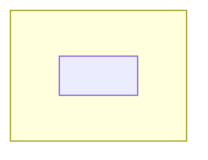

# Report style

A report has two shapes. Pick one before writing, because they argue differently:

- a **record** survives the conversation — durable, self-contained, every fact keyed;
- a **brief** transfers a design to a peer — usually ephemeral chat, and it may assume
  the conversation.

Both obey one rule: **every assertion carries its warrant** — derived, measured, or
marked open. Everything below is required unless marked optional.

## Variant A — the record

Order: capture → reading frame (the one distinction the subject hangs on) → decompose
(layer → object → operation → lifecycle → extension point) → find the non-obvious
constraint or absence → description → diagrams → legend → abstract. Written last:
abstract.

| Element | Optional | Description |
| --- | --- | --- |
| Abstract | no | One page: subject, load-bearing findings, consequence for the reader. Introduces no claim the description does not expand. |
| Description | no | Numbered claim-bearing sections. Inventories — layers, objects, operations, lifecycle, extension points — as tables. Every fact carries a source key. Conclusions sit in sections headed "our analysis". |
| Diagrams | yes | 3–6 when present. Mermaid; one claim each; a caption and a name (`D1`…`Dn`). If a caption only restates the adjacent paragraph, cut the diagram. |
| Legend | no | Exactly three tables: Notation (marks actually used), Source keys (key → artifact with branch/date/pin → digest note), Terms (glossary of the names the source overloads). |
| Open capture list | yes | Unreachable primaries: source, blocker, intended capture method. Never reconstruct one from memory or a secondary source. |

Rules of the record: one source key per fact, every key resolving in the Legend; capture
scope per source (artifact, branch/tag, date, pinned or not); digest and interpretation in
different notes — the report links, never restates; in a vault the artifact is `report.md`
under the topic, linked from `index.md` as "start here", digests in `sources/`; verify links
against the filesystem before finishing.

````markdown
---
title: <Subject> — Report
tags:
  - <topic>
  - report
created: YYYY-MM-DD
---

# <Subject> — Report

Sources: <artifacts> | Captured YYYY-MM-DD | <pinned or not> | Source keys resolve in Legend.

## Abstract

## Description

### 1. <reading frame>
### 2. <layer map>

## Diagrams

### D1 — <claim>



## Legend

### Notation
### Source keys
### Terms
````

## Variant B — the brief

The reader is fluent in the field and new to this work: no scaffolding, no signposting,
and the notation is introduced inline and used immediately. The elements run in this
order, and each one earns its place:

| # | Element | What it does | Failure if dropped |
| --- | --- | --- | --- |
| 1 | Premise correction | restates the question's assumption and fixes it if it is wrong | the reader keeps the wrong frame and reads every detail through it |
| 2 | The one claim | the load-bearing statement, once, in domain vocabulary | the piece becomes an inventory with no thesis |
| 3 | The formal object | the machine or definition inline, only the parts that matter | the mechanism reads as folklore |
| 4 | The mechanism, as steps | enable → issue → land → join, each step a state transition | narrative replaces operational detail |
| 5 | Local vs shared accounting | what is per-X, what is global, and why that split | the design's actual choice is invisible |
| 6 | Obligations | each invariant attached to the failure it prevents | soundness claims look like taste |
| 7 | Contrast set | the nearest designs and the exact difference from each | the design seems invented rather than positioned |
| 8 | Claim boundary | measured / by design / unmeasured / deliberately not claimed, with each residual where it lives | over-claim; the reader trusts more than was shown |
| 9 | Evidence anchor *(optional)* | the numbers and the one command that reproduces them | a transfer with no ground truth |

Rules of the brief: status tags on assertions; contrast pairs instead of adjectives
("semantics, not scheduling"); second person only for the reader's likely misconception;
the closing paragraph is a **boundary, not a summary**; no motivational framing and no
restatement of what was just said.

```
1  The frame: restate the premise; correct it if it is wrong.
2  The claim: one sentence, domain terms.
3  The object: the machine/definition, inline, minimal.
4  The mechanism: numbered operational steps, each a transition.
5  Accounting: what is local to X, what is shared — and why that split.
6  Obligations: invariant → the failure it prevents.
7  Contrasts: nearest designs, and the exact difference.
8  Boundary: measured | by design | unmeasured | not claimed, with where each lives.
9  (optional) The evidence: the numbers, and the one command that reproduces them.
```

## Rules for both

- Never state what you did not read.
- Keep the source's vocabulary, and flag every name it overloads — a paraphrase diverges
  silently, a link is a claim about a version.
- Subtract before you add: an element that restates its neighbour (an order section that
  repeats the skeleton, a checklist that repeats the elements) is cut, not kept.
